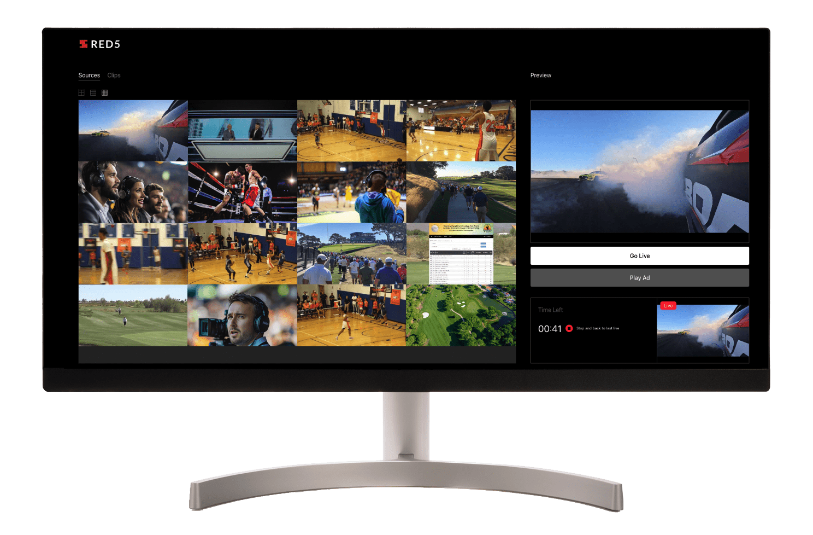

<h3 align="center">
  
</h3>

# Red5 TrueTime Studio for Production



The Red5 TrueTime Studio for Production is a web-based application for broadcasting content providers that provides an interface to preview multiple live streams delivered in a single stream from the [Red5 TrueTime Multiview for Production](https://github.com/red5pro/truetime-production) technology to deliver Interstitial streams to multiple end-users with sub-400ms latency.

Along with being able to select a single live stream to deliver from several concurrent live streams, the web-based application allows for pre-recorded Clip and Ad insertion during a live stream. Once either a Clip or Ad has finished, the stream will return to the previously selected live stream.

> For more information about the single stream of multiple live streams, please refer to the [Red5 TrueTime MultiView for Production](https://github.com/red5pro/truetime-production).

- [Running Locally](#running-locally)
- [Project Structure](#project-structure)
- [Usage](#usage)
  - [Query Params](#query-params)
- [Examples](#example-usage)

# Running Locally

This project was setup using [Vite](https://vitejs.dev/).

```sh
npm install
npm run dev
```

Open [http://127.0.0.1:5173](http://127.0.0.1:5173) in your favorite browser.

## Build

To build the project, issue the following (after having already run `npm install`):

```sh
npm run build
```

This will generate the built files in a `dist` directory.

> Note: It is not necessary to build the project. This repository can be deployed and accessed from a web browser without generating minified content.

# Project Structure

The following defines the role of the relevant files for the project.

> Please view the files individually for more comments and information.

## index.html

The [index.html](index.html) only and main HTML page of the TrueTime Studio for Production web application.

## style/main.css

the [main.css](style/main.css) file is the main style declarations for the TrueTime Studio for Production web application.

## Scripts

### script/main.js

The [main.js](script/main.js) file is the main entry for the application and is loaded as a `module`.

### script/mixer-service.js

The [mixer-service](script/mixer-service.js) is responsible for interfacing with the BrewMixer API. The BrewMixer API is exposed from the `brewmixer` webapp installed on the same server as the Interstitial plugin as is responsible for mixing mulitple streams into a grid and delivering a single stream to be consumed.

> For more information about the single stream of multiple live streams, please refer to the [Red5 TrueTime MultiView for Production](https://github.com/red5pro/truetime-production).

### script/interstitial-service.js

The [interstitial-service](script/interstitial-service.js) is responsible for interfacing with the Interstitial API to live switch streams delivered to every subscriber of the initial interstitial stream. Live streams and pre-recorded files (a.k.a., Clips and Ads) can be switched to and delivered live to all viewers.

### script/clips-service.js

The [clips-service](script/clips-service.js) is responsible for interfacing with the `clips.jsp` servlet. The `clips.jsp` servlet is a very basic service to return a listing of MP4 and FLV files available from the `streams` directory of the target scope on the server.

### script/ad-service.js

The [ad-service](script/ad-service.js) is responsible for selecting an Ad file to be streamed as an interstitial. It currently holds a canned list of files it assumes to be available from the server that is serving the interstitial stream.

### script/clips-controller.js

The [clips-controller](script/clips-controller.js) integrates with the `clips-service` to display a grid of available pre-recorded clips available to preview and insert into the interstitial stream to be delivered all subscribers.

### script/mixer-controller.js

The [mixer-controller](script/mixer-controller.js) intergrates with the BrewMixer API and provides User-based interaction between the playback of the mixed stream and selection, as well as drag-and-drop capabilities, to the gridded area in order to preview a single live clip from the single grid.

### script/preview-container.js

The [preview-container](script/preview-container.js) provides the UI behavoiur in previewing live and pre-recorded streams. It handles being able to playback both live and recorded content, as well as provide droppable areas for Users to change the preview. Additionally, it has controls for requesting to insert live or pre-recorded content (a.k.a., Clips and Ads) into the interstitial stream.

### script/source-container.js

The [source-container](script/source-container.js) provides the UI behavious in switching between the single gridded mixed stream and the grid listing of available Clips.

### script/coord-util.js

The [coord-util](script/coord-util.js) is a utility to convert points within the single grid of mixed content to access the proper stream under the mouse/click pointer.

### script/url-util.js

The [url-util](script/url-util.js) is a utility to access and provide query parameters from the URL that is used to configure the web application.

# Usage

When visiting the TrueTime Studio for Production web applicatoion - either through launching in `dev` or loaded from a built distribution - there are several optional query params that can be added to the landing URL to configure the app to use your own Red5 Pro Server deployment and playback live streams.

Once loaded with the proper configurations you will be able to view a grid of mixed streams to select from, as well as a grid of pre-recorded Clips to select and insert into the interstitial.

> It is important to note that your Red5 Pro Server will need to be properly configured to allow for both Interstitial streaming and BrewMixer functionality for TrueTime Mutliview for Production.

## Query Params

The following query parameters are available. Though _optional_, it is recommended to use in order to properly configure your TrueTime Studio for Production session.

| Param Name          |       Default Value        | Description                                                                                                                                  |
| :------------------ | :------------------------: | :------------------------------------------------------------------------------------------------------------------------------------------- |
| `host`              | `window.location.hostname` | The Red5 Pro Server endpoint that hosts the live streams. _The FQDN_                                                                         |
| `app`               |           `live`           | The webapp context on which the live streams reside.                                                                                         |
| `port`              |           `443`            | The port to use if the web application is delivered over SSL.                                                                                |
| `unsecure_port`     |           `5080`           | The port to use if the web application is _not_ delivered over SSL.                                                                          |
| `streamName`        |         `stream1`          | The main stream name feed to be used as the Interstitial that other live and pre-recorded streams will be inserted into during live playback |
| `mixer_host`        | `window.location.hostname` | The endpoint URL that the BrewMixer webapp resides on. _The FQDN_                                                                            |
| `mixer_event_name`  |          `event1`          | The event name form the BrewMixer to subscribe to and interact with                                                                          |
| `mixer_stream_name` |           `mix1`           | The stream name of the single stream output from the BrewMixer                                                                               |

# Example Usage

## Requirements

The TrueTime Studio for Production example utilizes the following additional features available for Red5:

- Interstitial Plugin [read the documentation](https://www.red5.net/docs/special/interstitial/server-configuration/)
- BrewMixer webapp [read the documentation](https://www.red5.net/docs/red5-pro/users-guide/mixer/brew-mixer-overview/)

These will both need to be properly configured in order to use this web application example, preferrably on the same machine as the Interstitial switching requires streams to be available from the same location.

> Additionally, if you are deploying the web application example on another server other than the Red5 deployment, ensure that it is served over SSL and that CORS is properly enabled for the Red5 server and its webapps.

**NOTE**

In order to properly access the canned listing of Clips and Ads from the `streams` directory of the webapp scope, you may also need to modify some of the settings for access.

For instance, to allow access to such files/streams, you may need to remove the following security restriction from `webapps/root/WEB-INF/web.xml`:

```xml
<security-constraint>
    <web-resource-collection>
        <web-resource-name>Forbidden</web-resource-name>
        <url-pattern>/streams/*</url-pattern>
    </web-resource-collection>
    <auth-constraint />
</security-constraint>
```

## Query Params

Assuming we have deployed out web application at `https://myappserver.com`, and that our Red5 deployment with BrewMixer and Interstitial is enabled at `myred5server.com`:

```sh
https://myappserver.com/?host=myred5server.com&app=live&mixer_host=myred5server.com&mixer_event=event1&mixer_stream_name=mix1&streamName=stream1
```

Using the above query params, we are telling the web application that:

- Our Red5 Server that we want to consume the stream `stream1` as the Interstitial is available at `https://myred5server.com`
- The target webapp that all streams to insert into the Interstitial reside in the webapp named `live` (default)
- The BrewMixer webapp is running on `https://myred5server.com` and currently is broadcasting a mixed stream of streams associated with `event1` out to a single stream named `mix1`

## Clips

The `ClipsService` of the web application assumes that the `server/clips.jsp` script is installed in the `live` webapp of the target Red5 server deployment. The `clips.jsp` is a simple script that will return a listing of all MP4 and FLV files in the `streams` directory of the webapp (e.g., `live`).

The `ClipsService` will parse this list and create a manifest of clips it considers available for Interstitial insertion. The rules for this manifest creation are:

- There is a pairing of MP4 and FLV files sharing the same filename (with different extensions)
  - The reason for the pairing: only MP4 can be played back in the browser. FLV is used for intersititial insertiion.
- The structure of each entry in the manifest will have the following schema:

```json
{
  "name": "<filename without extension>",
  "filename": "<the MP4 file with extension>",
  "streamGuid: "${app}/${name}.flv",
  "url": "${endpoint}/${app}/${name}.mp4"
}
```

The `streamGuid` will be used in requesting Interstitial insertion of the live stream, while the `url` will be used as the `src` for the `video` element on the page to preview the Clip.

## Ads

The `AdsService` provides a canned listing - with same schema as described in previous section - of Ad files to be used for Interstitial insertion. Its canned listing is filtered out of those for the Clips Service.
